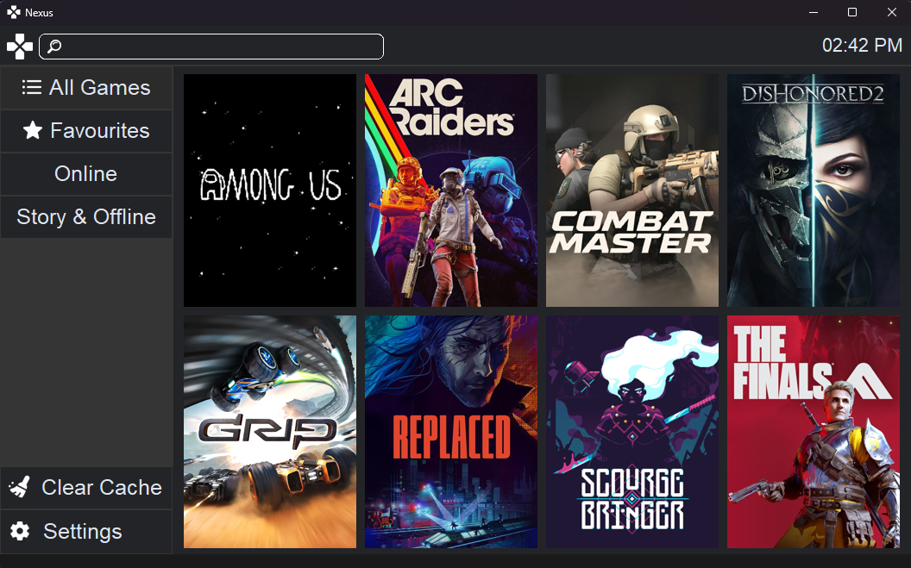
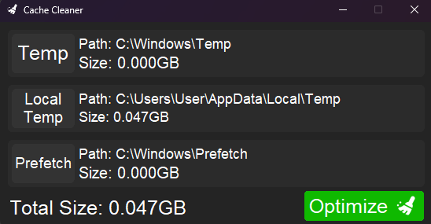

# 🚀 Nexus Launcher
**Your Unified Gaming Library & System Optimizer**

Nexus is a minimalist, modern, and high-performance game launcher designed to bring all your digital collections into one place. No more switching between multiple launchers; Nexus organizes your library and keeps your system lean for the best gaming experience.

---

 

## ✨ Key Features

### 🎮 Unified Game Library
- **Manual Addition:** Add any game or executable to your library with custom paths.
- **Auto-Scan Platforms:** Instant integration with major platforms:
  - **Steam**
  - **Epic Games**
  - **GOG**
- **Xbox & Microsoft Store Support:** Deep scanning for AppxPackages to detect games installed via PC Game Pass or the Microsoft Store.

### 📂 Advanced Organization
- **Smart Categories:** Divide your library into genres like **Action, Horror, Online, Story**, or create your own.
- **Total Control:** Edit, reorder, and customize your categories to fit your playstyle.

### ⚡ System Optimization (Cache Cleaner)
- **Built-in Cleaner:** Nexus isn't just a launcher; it helps you reclaim disk space and speed up your OS by cleaning Windows junk/cache files.
- **Automation:** Set up **Auto-Clean** and **Auto-Scan** on startup to ensure your PC is always "Game-Ready" without manual effort.

---

## 🛠️ Tech Stack
- **Language:** Python 3.x
- **UI Framework:** CustomTkinter (Modern & Dark-themed)
- **Libraries:** PIL (Pillow), Requests, Subprocess (for PowerShell integration).

## 🚀 Getting Started
1. Download the latest version from the [Releases](https://github.com/AbdulRahmanElsa3ed/Nexus-Launcher/releases) page.
2. Extract the `.rar` file.
3. Run `Nexus.exe`.
*Note: Keep the `assets` and `data` folders in the same directory as the executable.*

## 📈 Roadmap
- [ ] Manual Game Details Editor (Coming Soon)
- [ ] Game Information Panel & Stats (Coming Soon)

---

## 🤝 Contributing
Contributions, issues, and feature requests are welcome! Feel free to check the issues page.

## 📜 License
Distributed under the MIT License. See `LICENSE` for more information.
